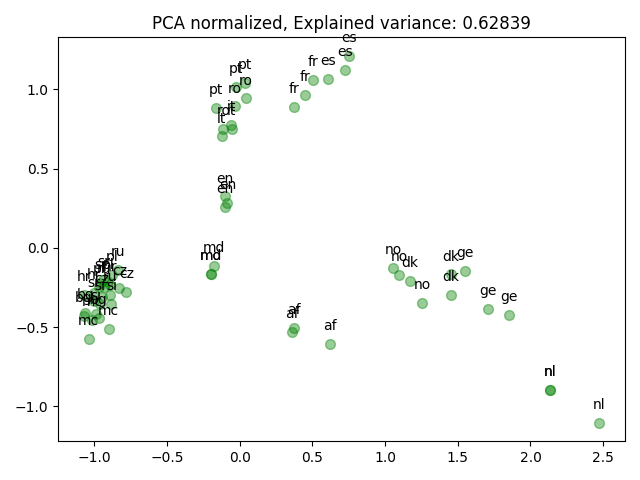
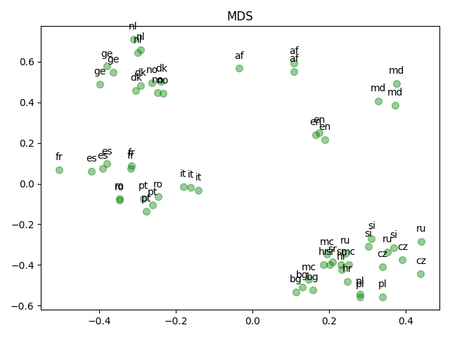
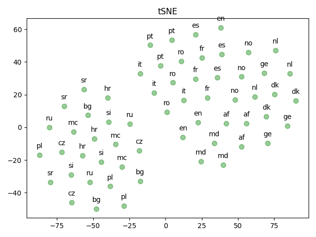

# Naloga 3
Ljubljana, 12.11.2020  
Jakob Udovič, 63180301

<!--  -->

## PCA

Graf 1: Graf normaliziranih podatkov (rezultatov) pridobljenih z metodo glavnih komponent.  
Visoka opisna varianca pri nenormaliziranih podatkih. Vrednost je kar večja od 0.7, kar se mi za dokumente s 100 
parametri prikazanimi v 2D prostoru zdi precej veliko.

Po diskusiji in premisleku sem podatke (nterke) normaliziral na način, da sem delil število pojavitve neke nterke v 
nekem dokumentu z dolžino tega dokumenta.  
To je sicer zmanjšalo vrednost moje dosežene opisne variance, vendar rezultati zgledajo bolj "realni", lažje opisljivi, in temu primerno 
tudi bolj primerljivi z rezultati metod v nadaljevanju.

  
Graf 2: Graf normaliziranih podatkov (rezultatov) pridobljenih z metodo glavnih komponent.  

Na grafu 2 se že lepše vidijo jezikovne skupine, njihove oddaljenosti oziroma bližine. Interpretacija rezultatov je 
tokrat nekoliko lažja, saj lahko podobne jezike povežemo med sabo in jim določimo pripadnost neki skupini.  
Na grobo lahko bolj pri vrhu grafa ocenimo romansko jezikovno skupino, desno spodaj pa bi lahko rekli, da se nahajajo jeziki 
germanskih korenin.  
Madžarščina je nekoliko osamljena na sredini. Ostane nam še vrsta slovanskih jezikov, ki ležijo precej blizu drug 
drugega na levi strani grafa.  

Tehnika PCA ohranja pri redukciji dimenzij oziroma projekciji podatkov na nižje dimenzije **varianco**. 

## MDS

  
Graf 3: Graf normaliziranih podatkov (rezultatov) pridobljenih z metodo MDS.    

Kot lahko vidimo, so si MDS in PCA rezultati vizuelno precej prodobni.  
Spet se lepo vidita germanska in slovnakska skupina, tudi germanska je z izjemo osamljene angleščine precej očitna.  
Madžarščina je pričakovano sama v zgornjem desnem kotu.  

MDS želi držati globalno strukturo vizualizacije intaktno. 
Dolge razdalje ostanejo točno take, kot so v originalnem prostoru.  

### tSNE  
  
Graf 4: Graf normaliziranih podatkov (rezultatov) pridobljenih z metodo t-SNE (stochastic neighbour embedding).    

t-SNE so pomembni le bližnji sosedi, ne toliko daljše razdalje (osredotoči se na sosednost / poudarja soseščino).  
Opazimo lahko dokumente istih jezikov dovolj skupaj en drugemu.  Razdalje me jezikovnimi skupinami ni moč zlahka razbrati.  

---

PCA: Projekcija točk na nižje dimenzije s pomočjo nekega predpisa, transformacije.  
t-SNE & MDS: Vložitev točk v nižjedimenzionalne prostore na podlagi neke kriterijske funkcijo.  

